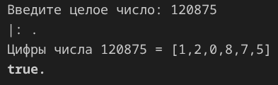
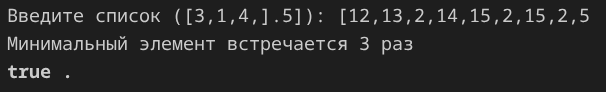
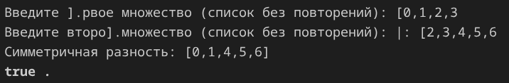
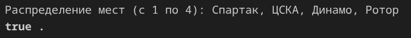

# Поморцев Аким КМБ-1 Лабораторная №5

# Задание 1

## Задача 1

### Текст задачи

Дано натуральное число N. Составить программу формирования списка,
элементами которого являются цифры числа N.

### Алгоритм решения

Пользователь вводит натуральное число N. С помощью рекурсивного предиката digits_helper каждый шаг делит число на 10, остаток от деления (mod 10) добавляется в аккумулятор-список, целая часть (div 10) передаётся в следующий вызов. Когда число становится равным нулю, рекурсия завершается и накопленный список разворачивается в правильном порядке. В итоге формируется список цифр исходного числа и выводится на экран. Программа завершает работу.

### Тестирование

# Задание 2

## Задача 1

### Текст задачи

Определить, сколько раз встречается минимальный элемент в списке.

### Алгоритм решения

Пользователь вводит список целых чисел. С помощью рекурсивного предиката find_min последовательно сравниваем каждый элемент списка с текущим минимумом, обновляем минимум при нахождении меньшего значения. Затем рекурсивный предикат count_elem проходит по списку второй раз и подсчитывает, сколько раз минимальный элемент встречается, увеличивая счётчик при совпадении. В итоге формируется числовое значение количества вхождений и выводится на экран. Программа завершает работу.

### Тестирование

# Задание 3

## Задача 1

### Текст задачи

Определим множество как список без повторяющихся элементов. Найти
симметричную разность множеств.

### Алгоритм решения

Пользователь поочередно вводит два множества в формате списков. С помощью рекурсивного предиката filter_not_in каждый элемент первого списка проверяется на принадлежность второму множеству через member, если элемент не найден — добавляется в результат. Затем та же операция выполняется для второго списка относительно первого. Полученные два списка объединяются через append. В итоге формируется список элементов симметричной разности и выводится на экран. Программа завершает работу.

### Тестирование

# Задание 4

## Задача 1

### Текст задачи

Болельщики футбольных команд делали прогнозы об итогах соревнований
«Турнир четырех»:
— Я уверен, что Спартак будет чемпионом, а ЦСКА займет последнее место —
сказал Иван.
— Что ты, Спартак выше третьего не поднимется, а ЦСКА станет вторым —
возразил Сергей.
— Чемпионом будет Динамо, а ЦСКА войдет в тройку сильнейших — сделал
свой прогноз Петр.
— Динамо будет вторым, а вот Ротор точно будет последним — промолвил
Алексей.
Выяснилось, что каждый из болельщиков был прав в одном прогнозе и ошибся
во втором. Как распределились места, занятые командами?

### Алгоритм решения

Программа не требует ввода пользователем, данные фиксированы в условии задачи. С помощью встроенного предиката permutation генерируются все возможные варианты расстановки команд на четыре места. Для каждой перестановки рекурсивный предикат get_place определяет место каждой команды в списке. Затем проверяются четыре логических условия — каждый болельщик должен быть прав ровно в одном из двух прогнозов (реализовано через исключающее ИЛИ). При нахождении перестановки, удовлетворяющей всем условиям, рекурсия завершается. В итоге формируется единственное верное распределение мест по командам и выводится на экран. Программа завершает работу.

### Тестирование

